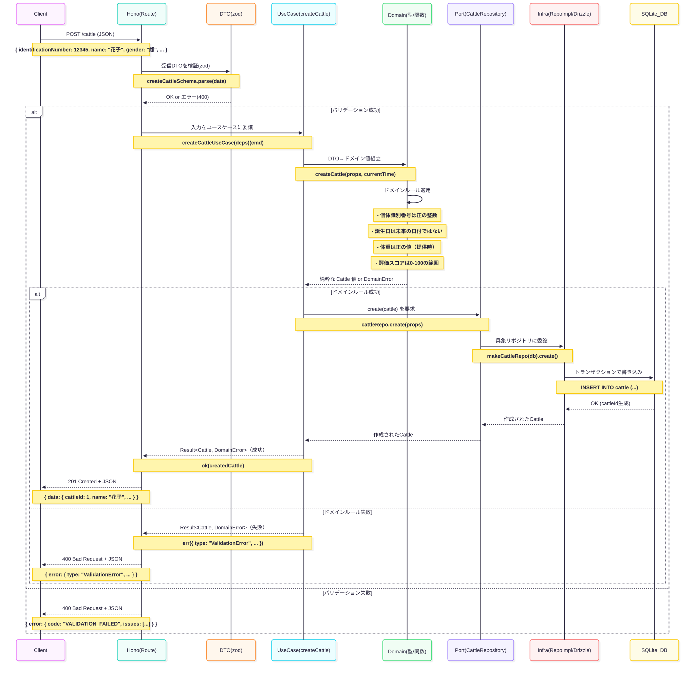

# 🐄 Gyulist — 牛群管理システム

概要: 畜産農家の「牛の個体・繁殖・イベント管理」を、型安全なフルスタックで高速・確実に。

[](https://gyulist.com)
[](https://katsuya6152.github.io/gyulist/swagger/)
[](https://katsuya6152.github.io/gyulist/typedoc/)

## ⚡ TL;DR（要約）
- 技術スタック: Next.js 15 / Hono (既存) + Go 1.23 (移行中) / Cloudflare Workers & Pages / D1(SQLite) + PostgreSQL (Go版) / Drizzle + GORM / TypeScript / pnpm / Biome
- コア機能: 個体CRUD・検索/絞り込み・イベント登録・認証（JWT/Cookie）・KPIダッシュボード
- ドキュメント/デモ:
  - デモ：https://gyulist.com/
  - Swagger UI: https://katsuya6152.github.io/gyulist/swagger/
  - TypeDoc API: https://katsuya6152.github.io/gyulist/typedoc/
  - アーキテクチャ/実装ガイド: docs/ 配下（[索引](./docs/README.md)）

## 🔍 What’s this（問題・背景）
- 想定ユーザー: 畜産農家・飼養管理者・出荷管理担当
- 背景課題: 紙台帳/Excel管理の限界（入力負荷・見落とし・集計遅延）
- 解決アプローチ: 型安全なWebアプリで「統一入力」「自動計算」「検索・通知」「KPI可視化」を提供
- 成果指標: 入力時間短縮、予定/リスク見落とし削減、記録の完全性・一貫性向上

## ✨ ハイライト（3点）
- 型安全フルスタック（Zod/InferResponseType + Hono RPC的開発体験）
- 低運用コスト（Cloudflare Pages/Workers/D1 でスケーラブル＆軽量）
- 保守性の高い設計（関数型ドメインモデリング+ヘキサゴナルアーキテクチャ、Container/Presentational パターン）

## 🏗️ アーキテクチャ概要
- フロント（Next.js）→ API（Hono/Workers）→ DB（D1/Drizzle）
- 通知（将来拡張）: Email/LINE/PWA を予定
- モノレポ構成: 型/スキーマ共有・再利用性向上・一貫したCI
- API: 関数型ドメインモデリング+レイヤードアーキテクチャ（Application/Domain/Infrastructure/Interfaces）
- Web: Container/Presentational パターン

*アーキテクチャ図*


*シーケンス図*


## 📁 ディレクトリ構成
```
apps/
  web/       # Next.js (App Router)
  api/       # Hono + Cloudflare Workers, D1/Drizzle (既存)
    ├── application/    # アプリケーション層（ユースケース、DTO、スキーマ）
    ├── domain/         # ドメイン層（ビジネスロジック、型定義、ポート）
    ├── infrastructure/ # インフラ層（DB、外部サービス、設定）
    └── interfaces/     # インターフェース層（HTTP、バッチ）
  api-go/    # Go 1.23 + Gin/GORM + PostgreSQL (移行中)
    ├── cmd/            # エントリーポイント
    ├── internal/       # プライベートアプリケーションコード
    │   ├── application/# アプリケーション層
    │   ├── domain/     # ドメイン層
    │   ├── infrastructure/ # インフラ層
    │   └── interfaces/ # インターフェース層
    ├── configs/        # 設定ファイル
    ├── specs/          # OpenAPI仕様
    └── tests/          # テストコード
docs/
  api-spec/  # 内部処理要件中心のAPI仕様
  ...        # アーキテクチャ/実装/DB ガイド
```

## 🧰 技術スタック（採用理由）
- フロント: Next.js 15（App Router/Server Components/Server Actions）— SSR最適化
- API: Hono — 軽量・高速、型安全なエンドポイント定義
- DB: Cloudflare D1 + Drizzle — Edge環境適合、型安全クエリ
- インフラ: Cloudflare Pages/Workers — 簡易デプロイ、低運用コスト
- 品質: TypeScript strict / Biome / Vitest / Playwright — 品質と開発速度両立
  - Go版追加: Google Wire (DI), Zap (ログ), Testify (テスト), golangci-lint (品質)
  - 移行理由: パフォーマンス向上、運用コスト最適化、技術スタック多様化
  - トレードオフ: D1機能制約, React/Nextの最新機能に伴うライブラリ互換注意

## ✅ 機能一覧
- 個体CRUD・検索/絞り込み/ソート/カーソル形式ページング
- イベント登録（型・時刻・整合チェック）
- 認証（Cookie-JWT）
- KPI（繁殖指標）とアラート
- 管理用CSVエクスポート

## 🙋‍♂️ 担当範囲（個人開発）
- 企画 / 設計 / 実装（Web/API/DB） / インフラ / CI/CD / デザイン

## 🚀 クイックスタート
前提: Node.js 20+, pnpm, Cloudflare アカウント, Wrangler
```bash
pnpm install
# API
cd apps/api
pnpm migrate:local
pnpm dev
# Web
cd ../web
pnpm dev
```
主要スクリプトはリポジトリ各 `package.json` を参照

## 🔧 環境変数
- API: `JWT_SECRET`, `TURNSTILE_SECRET_KEY`, D1接続系（wrangler設定）
- Web: `NEXT_PUBLIC_API_URL`, `NEXT_PUBLIC_TURNSTILE_SITE_KEY`
- 本番/ローカルで SameSite/secure の挙動を切替

## 🧪 APIサンプル
```bash
# healthcheck
curl -s https://<api-domain>/api/v1/health

# cattle 検索（JWT）
curl -H "Authorization: Bearer <token>" \
  "https://<api-domain>/api/v1/cattle?limit=20&sort_by=id"

# cattle 登録
curl -X POST -H "Authorization: Bearer <token>" -H "Content-Type: application/json" \
  -d '{"identificationNumber":123,"earTagNumber":{"number":456},"name":"テスト牛"}' \
  https://<api-domain>/api/v1/cattle

# cattle 削除
curl -X DELETE -H "Authorization: Bearer <token>" \
  https://<api-domain>/api/v1/cattle/1

# events 登録
curl -X POST -H "Authorization: Bearer <token>" -H "Content-Type: application/json" \
  -d '{"cattleId":1,"eventType":"CALVING","eventDatetime":"2025-01-01T00:00:00Z"}' \
  https://<api-domain>/api/v1/events
```
- OpenAPI/Swagger UI: https://katsuya6152.github.io/gyulist/swagger/

## 🔐 セキュリティ / 認証
- Cookie: httpOnly / secure / SameSite(None|Lax) を環境に応じて設定
- CORS: 既定の許可ドメイン/メソッドで制御
- エラーハンドリング: Result型 + 統一マッパー、予期せぬ例外は構造化ログ
- リトライ: クライアント側（サービス層）で段階的に実装

## 🧷 テスト / 品質
- Biome（lint/format）
- Vitest / React Testing Library / Playwright（E2E）
- GitHub Actions: lint / build / test / OpenAPI生成 & Pages公開

## 🚀 デプロイ
- Web: Cloudflare Pages（カスタムドメイン）
- API: Cloudflare Workers（Custom Domain）
- DB: D1（`migrations apply`）

## 🛠️ 運用 / 監視（案）
- 構造化ログ（環境別フォーマット）
- レート制御（KVなど）
- 重要操作の監査ログ/APIメトリクス可視化

## 📈 成果 / 学び
- 定量: 入力/検索速度の体感改善、運用コスト低減
- 定性: 関数型ドメインモデリング + ヘキサゴナルで保守性・可観測性が向上
