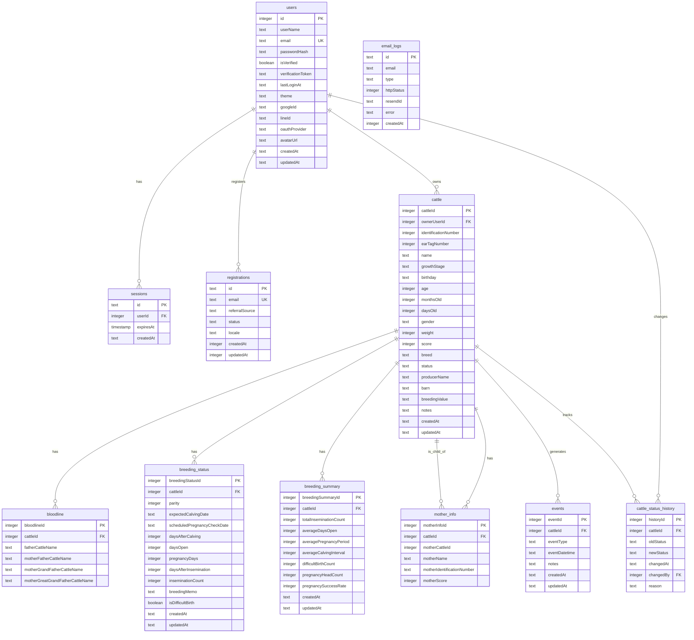

# Gyulist データベース ERD (Entity Relationship Diagram)

## 概要

Gyulistは畜産業界向けの牛群管理システムです。このドキュメントでは、システムのデータベース構造とエンティティ間の関係を図示します。

## エンティティ一覧

### 1. ユーザー管理系
- **users** - ユーザー情報
- **sessions** - セッション管理
- **registrations** - 事前登録情報

### 2. 牛群管理系
- **cattle** - 牛の基本情報
- **bloodline** - 血統情報
- **mother_info** - 母牛情報
- **breeding_status** - 繁殖状態
- **breeding_summary** - 繁殖統計

### 3. イベント管理系
- **events** - イベント記録
- **cattle_status_history** - ステータス変更履歴

### 4. システム管理系
- **email_logs** - メール送信ログ

## ERD 図



### Mermaid記法によるERD



## テーブル詳細説明

### 1. ユーザー管理系

#### users（ユーザー情報）
- システムの利用者情報を管理
- メール認証、OAuth認証に対応
- テーマ設定、アバター画像を保持

#### sessions（セッション管理）
- ユーザーのログインセッションを管理
- セッションの有効期限を制御

#### registrations（事前登録）
- システム利用前の事前登録情報
- 紹介元、ステータス、ロケールを管理

### 2. 牛群管理系

#### cattle（牛の基本情報）
- 牛の個体識別情報
- 成長段階、性別、品種、ステータス
- 体重、得点、生産者情報

#### bloodline（血統情報）
- 父牛、母の父、祖父、曾祖父の情報
- 血統管理と育種価の計算に使用

#### mother_info（母牛情報）
- 実際の母牛との関係
- 母牛の名号、識別番号、得点

#### breeding_status（繁殖状態）
- 現在の繁殖に関する状態
- 分娩予定日、妊娠日数、空胎日数
- 人工授精回数、難産記録

#### breeding_summary（繁殖統計）
- 繁殖に関する累計・統計情報
- 受胎率、平均空胎日数、分娩間隔

### 3. イベント管理系

#### events（イベント記録）
- 牛の一生涯のイベントを記録
- 繁殖、健康、成長、物流の各分野
- イベントタイプと日時、メモを保持

#### cattle_status_history（ステータス変更履歴）
- 牛のステータス変更の履歴
- 変更理由と変更者を記録

### 4. システム管理系

#### email_logs（メール送信ログ）
- システムからのメール送信履歴
- 送信結果、エラー情報を記録

## 主要なリレーションシップ

### 1. ユーザーと牛群
- 1対多の関係（1ユーザーが複数の牛を所有）
- 所有権によるデータ分離

### 2. 牛とイベント
- 1対多の関係（1頭の牛が複数のイベントを生成）
- 牛の一生涯の記録を管理

### 3. 牛と繁殖情報
- 1対1の関係（1頭の牛に1つの繁殖状態）
- 繁殖に関する詳細な状態管理

### 4. 牛と血統情報
- 1対多の関係（1頭の牛が複数の血統情報を持つ）
- 血統管理と育種価の計算

## データ型と制約

### 主キー
- すべてのテーブルで自動採番の整数IDを使用
- 一部のテーブルでUUID形式の文字列IDを使用

### 外部キー
- 適切な参照整合性制約を設定
- カスケード削除は設定していない（データ保護）

### 列挙型
- ステータス、成長段階、イベントタイプなど
- 事前定義された値のみ許可

### タイムスタンプ
- 作成日時、更新日時を自動設定
- UTC時間で統一管理

## インデックス戦略

### 推奨インデックス
```sql
-- ユーザー関連
CREATE INDEX idx_users_email ON users(email);
CREATE INDEX idx_users_google_id ON users(google_id);

-- 牛群関連
CREATE INDEX idx_cattle_owner_user_id ON cattle(ownerUserId);
CREATE INDEX idx_cattle_identification_number ON cattle(identificationNumber);
CREATE INDEX idx_cattle_status ON cattle(status);

-- イベント関連
CREATE INDEX idx_events_cattle_id ON events(cattleId);
CREATE INDEX idx_events_event_type ON events(eventType);
CREATE INDEX idx_events_event_datetime ON events(eventDatetime);

-- 繁殖関連
CREATE INDEX idx_breeding_status_cattle_id ON breeding_status(cattleId);
CREATE INDEX idx_breeding_status_expected_calving_date ON breeding_status(expectedCalvingDate);
```

## データ整合性

### ビジネスルール
1. **所有権チェック**: ユーザーは自分の牛のデータのみ操作可能
2. **ステータス遷移**: 牛のステータス変更は適切な順序で行う
3. **繁殖サイクル**: 人工授精→妊娠→分娩の流れを管理
4. **血統管理**: 血統情報の整合性を保つ

### 制約
- 必須フィールドのNOT NULL制約
- 一意性制約（メールアドレス、識別番号）
- 外部キー参照整合性制約
- 列挙型による値の制限

## パフォーマンス考慮事項

### クエリ最適化
- 複雑な繁殖KPI計算のための適切なインデックス
- 大量データの効率的な検索・集計
- ページネーション対応

### データ量
- 1ユーザーあたり数百頭の牛を想定
- 1頭あたり年間数十件のイベント
- 長期間の履歴データの保持

このERDは、Gyulistシステムのデータベース設計の全体像を示しています。畜産業界の専門的な要件に対応し、牛群管理に必要な情報を効率的に管理できる構造となっています。
