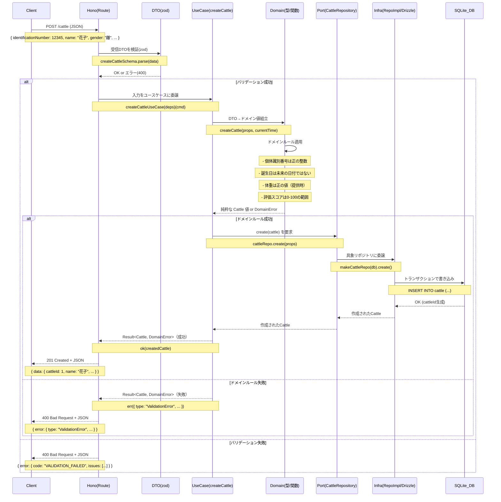
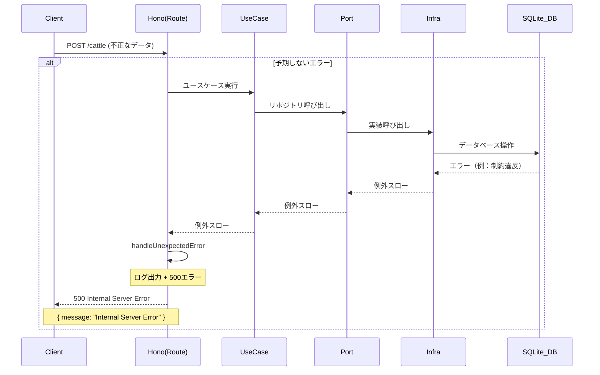
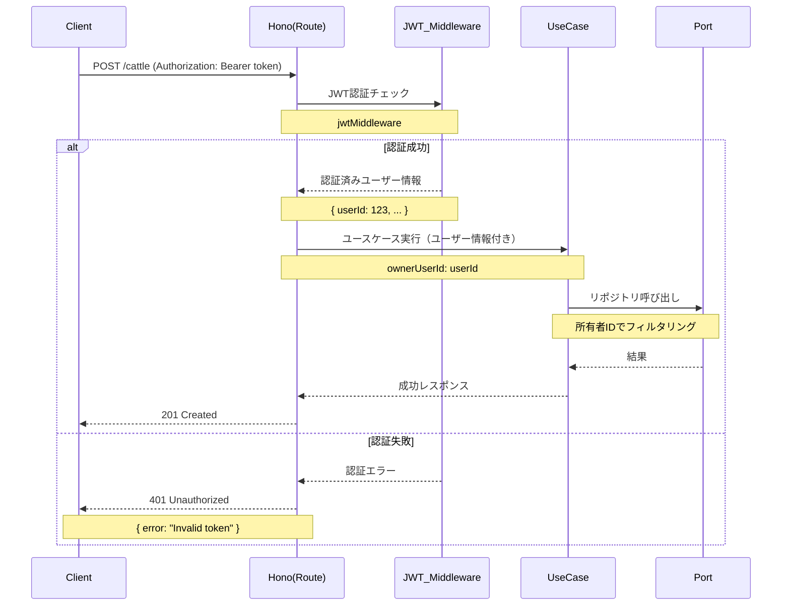
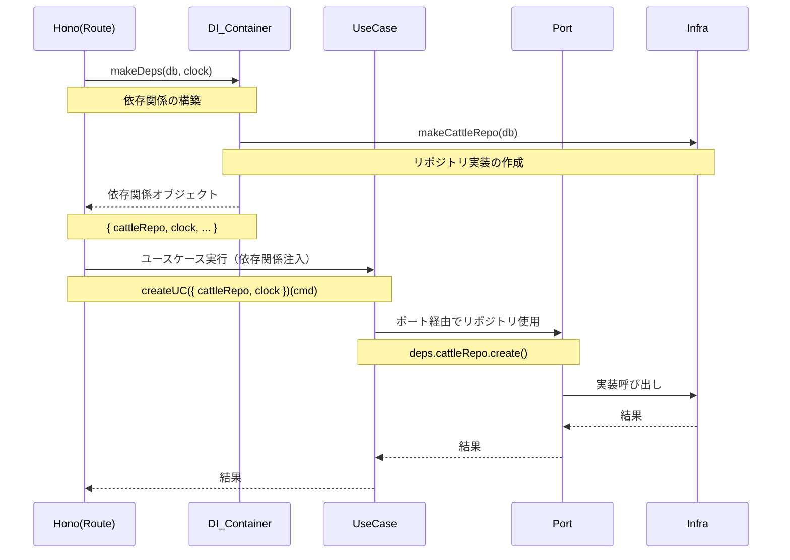

# Gyulist プロジェクト シーケンス図

## 牛の作成処理フロー

## エラーハンドリングフロー

## 認証・認可フロー

## 依存性注入フロー

## 主要な特徴

### 1. **Hexagonal Architecture**
- **Interfaces層**: Hono、zodバリデーション、JWT認証
- **Application層**: ユースケース、ポート定義
- **Domain層**: 純粋なビジネスロジック、エンティティ
- **Infrastructure層**: Drizzle ORM、SQLite

### 2. **エラーハンドリング**
- **Result型**: 成功/失敗を型安全に表現
- **統一エラーレスポンス**: HTTPステータスとJSON形式
- **ログ出力**: 予期しないエラーの記録

### 3. **依存性注入**
- **makeDeps**: 依存関係の一元管理
- **ポート**: インターフェースによる結合度の低下
- **テスト容易性**: モック可能な設計

### 4. **ドメイン駆動設計**
- **エンティティ**: Cattle（牛）
- **値オブジェクト**: CattleId、UserId、Status
- **ドメインルール**: ビジネスロジックの集約
- **集約**: Cattleをルートとする境界
